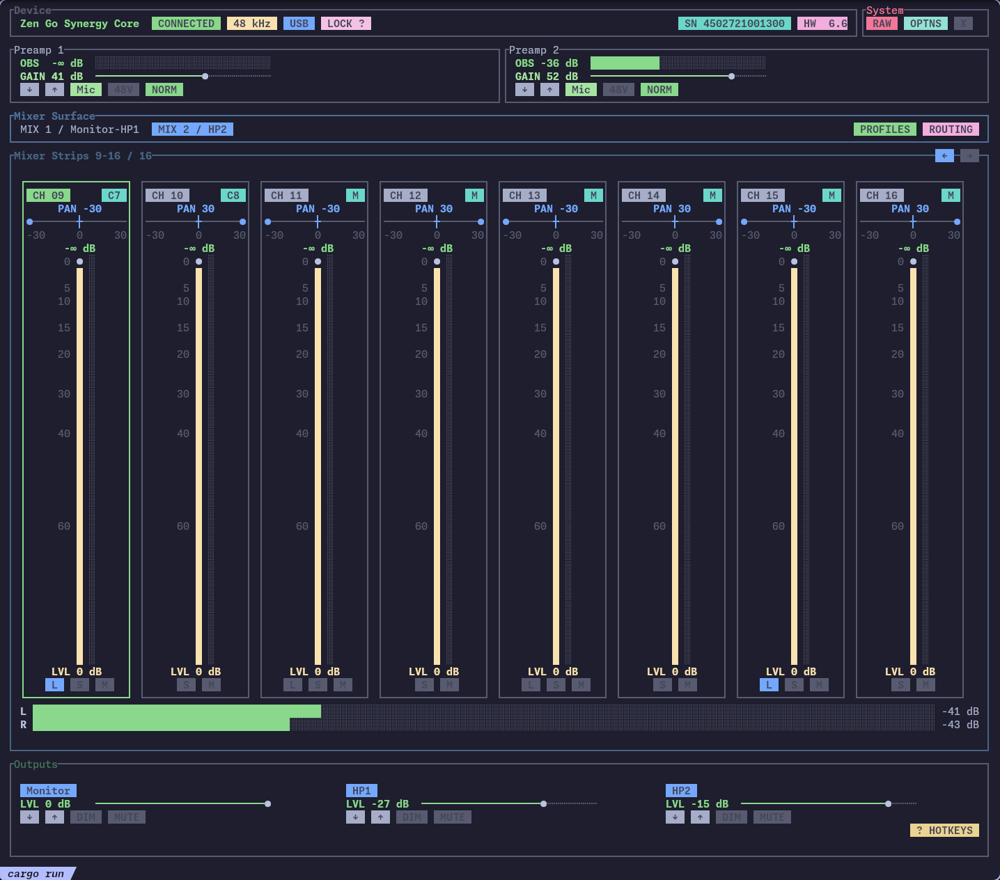
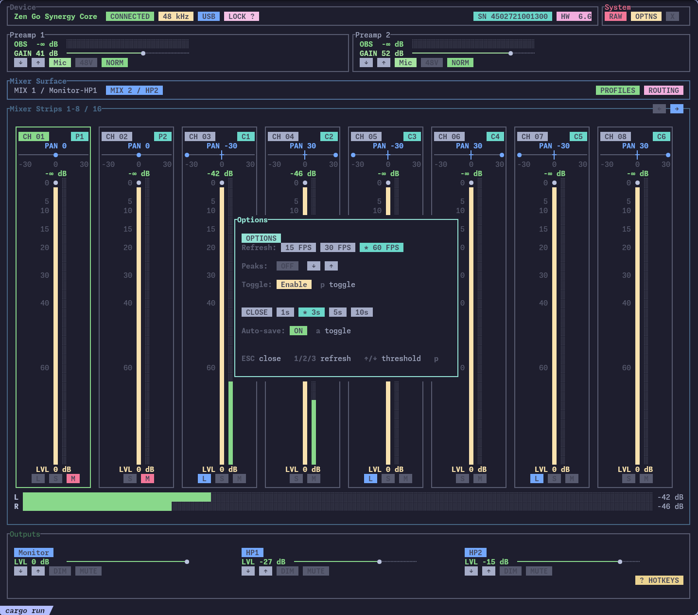
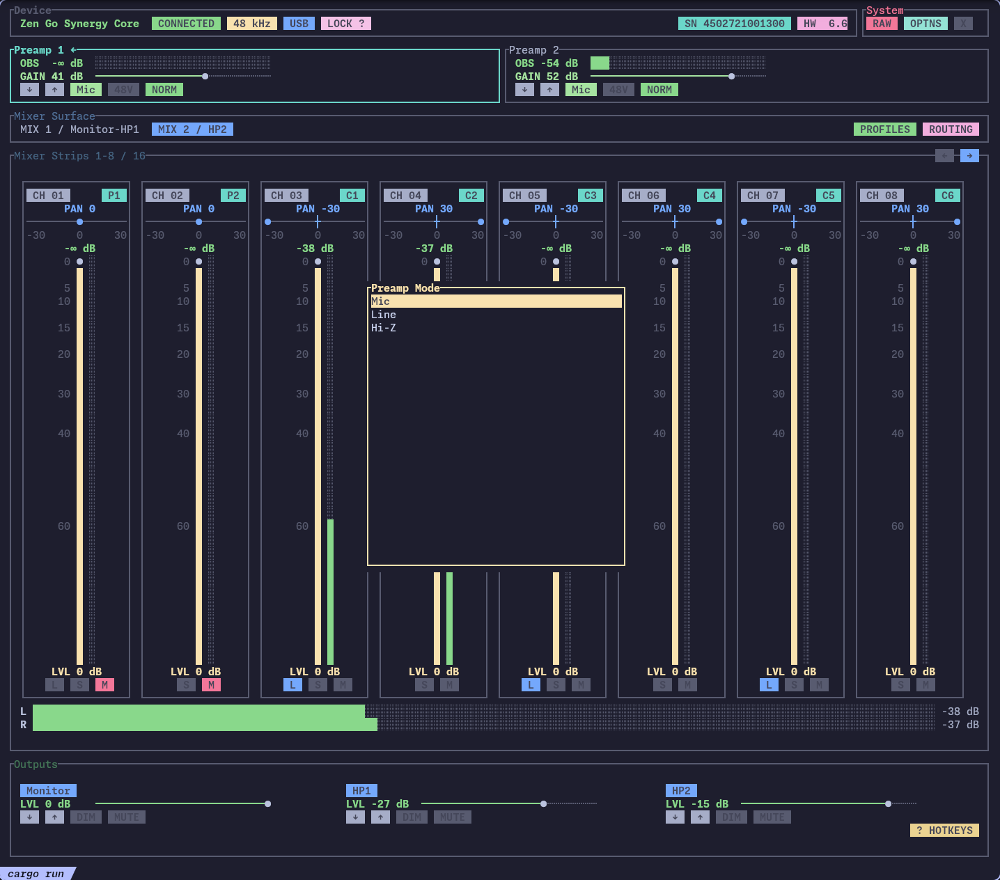
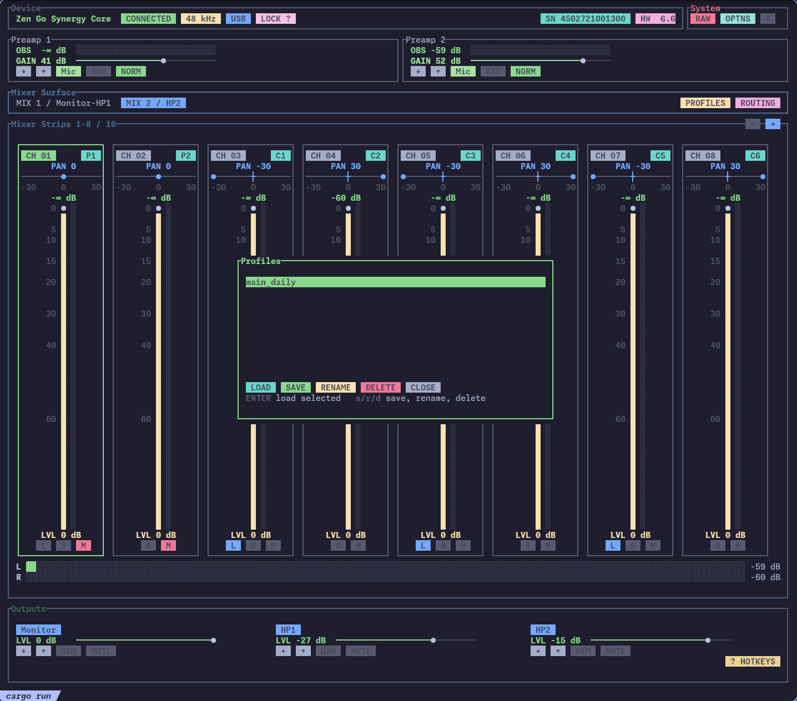
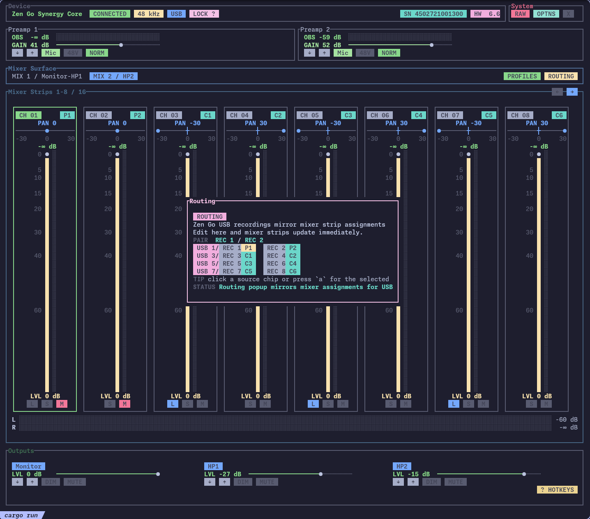

# zen-go-tui

Profile-driven terminal UI for supported Antelope Audio interfaces.

<p align="center">
  
</p>

<details>
<summary>More screenshots</summary>

**Options**



**Preamp / Source Type**



**Profiles**



**Routing**



</details>

## What it is

`zen-go-tui` is a Rust terminal application with catalog-driven Antelope device discovery. Zen Go Synergy Core is currently the only selectable device. Other known profiles remain visible with readiness diagnostics.

For Zen Go, the real-time TUI provides:

- **Outputs** — Monitor, HP1, HP2 volume, mute, dim
- **Mixer** — 16-channel stereo mixer with two surfaces (MIX 1 / MIX 2), per-strip level, mute, pan, link, and source assignment
- **Preamp** — A1/A2 gain, input mode (Mic / Line / Hi-Z), phantom power, phase invert
- **Meters** — per-strip and input peak meters on a shared scale
- **Profiles** — save and load device state to TOML profiles
- **Raw view** — live HID packet inspection with diff highlighting

Protocol facts come from canonical profiles, USB HID captures, and reviewed tests. See [device support and validation](docs/device-support.md) for evidence levels and current readiness.

## Requirements

- **Rust 1.70+** (edition 2021)
- **GNU Make** and **Python 3** for the repository workflows
- **Linux** — primary supported platform
- A supported Antelope device for real-device control. Zen Go Synergy Core is currently supported.

### Windows

A Windows build target exists (`x86_64-pc-windows-gnu`) but is **untested on real hardware**. If you try it, please report your experience in [Issues](https://github.com/ryodeushii/zen-go-tui/issues).

## Install

### From this repository

```bash
cargo install --git https://github.com/ryodeushii/zen-go-tui.git --bin zen-go-tui
```

This places the `zen-go-tui` binary in Cargo's bin directory.

## Build from source

```bash
git clone https://github.com/ryodeushii/zen-go-tui.git
cd zen-go-tui
make release
```

Output with the checked-in Cargo target configuration: `target/x86_64-unknown-linux-gnu/release/zen-go-tui`.

### Make workflows

The Makefile keeps submodule synchronization, profile generation, drift checks, and Rust commands explicit. Targets do not invoke one another implicitly.

| Target | Purpose |
| --- | --- |
| `make help` | Show the available targets (the default). |
| `make module-sync` | Initialize the Antelope-Ctl submodule and check out the revision pinned by this repository. |
| `make module-update` | Fast-forward the currently checked-out Antelope-Ctl branch from its configured upstream. It refuses dirty or detached submodule state. |
| `make generate` | Write both embedded artifacts: `src/device/generated.rs` and `src/device/generated_profiles.json`. |
| `make check-generated` | Check both generated artifacts for drift using the full generator check arguments; it does not write files. |
| `make release` | Run `cargo build --release --locked` using the checked-in generated artifacts. |
| `make test` | Run `cargo test --workspace`. |

After updating the profile branch, use this explicit workflow:

```bash
make module-update && make generate && make release
```

Normal releases do not fetch the submodule or regenerate artifacts implicitly. After changing profiles or the submodule revision, review the generated diff and run `make check-generated` before committing both generated files with the profile or submodule update. `make module-sync` restores the recorded submodule revision; skip it when intentionally working on a configured branch for `make module-update`. Generation and drift checks do not verify hardware behavior or resolve conflicting protocol evidence.

### Windows cross-build (from Linux)

```bash
rustup target add x86_64-pc-windows-gnu
cargo build --target x86_64-pc-windows-gnu --release
```

Requires a MinGW-w64 cross-toolchain.

## Run

### Device permissions (Linux)

To access the Zen Go without `sudo`, install the bundled udev rule:

```bash
sudo cp udev_rules/99-antelope.rules /etc/udev/rules.d/99-antelope.rules
sudo udevadm control --reload-rules
sudo udevadm trigger
```

Then unplug and reconnect the device.

### Real device

Start read-only discovery and the device picker:

```bash
zen-go-tui
# or from source:
cargo run
```

Select a unique device by identity, serial, or exact path:

```bash
zen-go-tui --device 23e5:a015
zen-go-tui --device serial:ZEN-SERIAL
zen-go-tui --device path:/dev/hidraw4
```

Load an additional validated normalized profile pack before discovery:

```bash
zen-go-tui --profile-pack ./profiles.json
```

The built-in catalog remains available when `--profile-pack` is absent. Disabled, partial, unverified, ambiguous, and unsupported candidates cannot open a control session.

See [device support and profile validation](docs/device-support.md) for selector rules, exact-path safety, reconnect identity checks, and the five-device support matrix.

### Mock mode (no device)

```bash
zen-go-tui --mock
# or:
cargo run -- --mock
```

## Keyboard controls

### Global

| Key | Action |
|-----|--------|
| `Tab` | Cycle focus between panels |
| `←` / `→` | Select output or mixer channel |
| `↑` / `↓` | Adjust level / gain / fader |
| `m` | Toggle mute |
| `d` | Toggle dim |
| `q` | Quit |
| `?` | Show quick help |
| `p` | Open profiles panel |
| `r` | Toggle routing panel |
| `O` | Toggle options panel |
| `R` | Refresh device state |
| `Ctrl+D` | Toggle raw view |
| `Ctrl+O` | Toggle options panel |
| `Ctrl+C` | Quit |

### Mixer (focus on mixer strips)

| Key | Action |
|-----|--------|
| `[` / `]` | Adjust mixer pan |
| `a` | Open source assignment picker |
| `o` | Toggle solo |
| `l` | Toggle link on visible pairs |

### Preamp (focus on preamp)

| Key | Action |
|-----|--------|
| `3` | Cycle input mode (Mic / Line / Hi-Z) |

### Global shortcuts

| Key | Action |
|-----|--------|
| `s` | Cycle sample rate (when clock source is internal) |
| `c` | Cycle clock source |
| `1` | Switch to Monitor / HP1 surface |
| `2` | Switch to HP2 surface |

### Raw view

| Key | Action |
|-----|--------|
| `b` | Capture baseline |
| `x` | Clear baseline |
| `←` / `→` | Cycle packets or scroll query replies |

### Profiles popup

| Key | Action |
|-----|--------|
| `↑` / `↓` | Navigate profiles |
| `Enter` | Load selected profile |
| `s` | Save profile |
| `r` | Rename profile |
| `d` | Delete profile |
| `Esc` | Close |

### Options popup

| Key | Action |
|-----|--------|
| `1` / `2` / `3` | Set refresh rate (15 / 30 / 60 fps) |
| `↑` / `↓` | Cycle peak threshold |
| `p` | Toggle peak meters |
| `h` / `H` | Cycle peak hold duration forward / back |
| `a` | Toggle auto-save |
| `Esc` | Close |

On the raw packet view page, `b` captures a baseline and `x` clears it.

## Protocol documentation

The full reverse-engineered protocol reference lives in [docs/](docs/):

- [Device support and profile validation](docs/device-support.md)
- [Zen Go application guide](docs/zen-go-tui.md)
- [Control Panel reference](docs/cpl.md)
- [Mixer protocol](docs/protocol/mixer-protocol.md)
- [Preamp protocol](docs/protocol/preamp-protocol.md)

## Profile files

A normalized profile pack is generated JSON that defines runtime protocol capabilities. A saved-state profile is a user TOML snapshot of control values. These files serve different purposes and are not interchangeable.

## Disclaimer

This project is **not affiliated with Antelope Audio**. All protocol details were derived independently from USB HID packet captures. Use at your own risk.

## License

MIT
